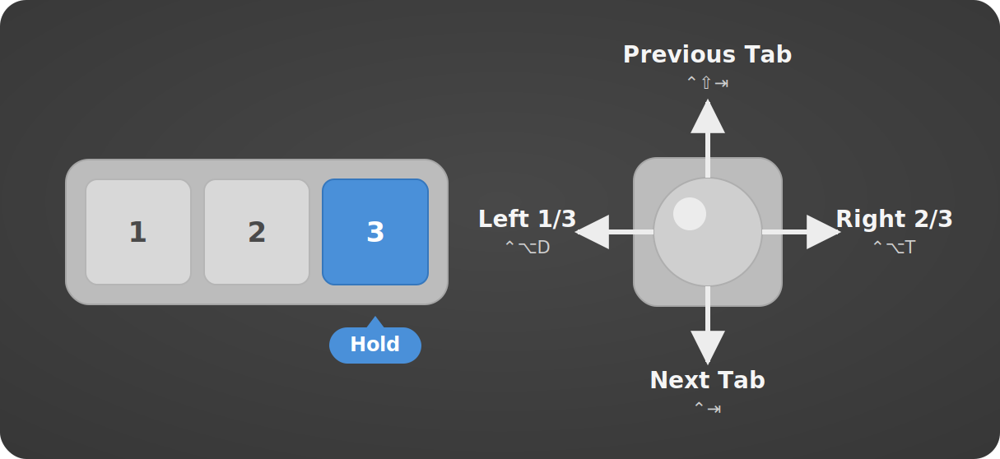

# ZMK Config for KimiBoard


This repository is a [ZMK](https://zmk.dev/) firmware configuration for sirocom's [KimiBoard](https://github.com/sirocominfo/zmk-config-KimiBoard), a 4-key Bluetooth/USB keyboard with a [PMW3610](https://www.pixart.com/products-detail/21/PMW3610DM-SUDU) trackball built on the [Seeed XIAO BLE](https://wiki.seeedstudio.com/XIAO_BLE/) (nRF52840). It supports up to 3 Bluetooth pairings, [mouse gestures](https://github.com/kot149/zmk-mouse-gesture) (scrolling, forward/back, and window management) via the trackball, and includes an [RGB LED status widget](https://github.com/caksoylar/zmk-rgbled-widget).

The KimiBoard is available for purchase at [sirocom's BOOTH shop](https://sirocom.booth.pm/items/8301933).

## Credits

This ZMK config is a fork of [sirocominfo/zmk-config-KimiBoard](https://github.com/sirocominfo/zmk-config-KimiBoard) by sirocom. Many thanks to the original author for the hardware design, base configuration, and the header photo.

## Default Keymap


Each key has a tap action, and Keys 2 and 3 are hold-taps (200 ms) that add a hold action: a quick tap sends a mouse click, while holding activates a momentary gesture layer. In the diagram above, white pills are tap actions and blue pills are hold actions. On the default layer, the trackball moves the pointer.

| Key | Tap | Hold (≥200 ms) |
|:-|:-|:-|
| 0 | Switch Bluetooth connection (cycle through 1 → 2 → 3) | — |
| 1 | Left click | — |
| 2 | Middle click | Scroll & Navigate gesture layer |
| 3 | Right click | Spaces & Mission Control gesture layer, or Rectangle gesture layer when Rectangle override is on |

Pressing two keys together triggers a combo:

| Combo | Action |
|:-|:-|
| 0 + 3 | Clear the current Bluetooth pairing |
| 2 + 3 | Toggle Rectangle override: switches Key 3 hold between the Spaces & Mission Control and Rectangle gesture layers |

### Scroll & Navigate gestures (hold Key 2)


This layer emulates the macOS **two-finger trackpad gestures** with the trackball. Hold **Key 2** to enter the scroll layer. While held, the cursor stays still: move the trackball up or down to scroll the page, or flick left or right to navigate forward or back. The forward/back shortcuts target Chrome on macOS:

| Trackball | Action | Shortcut |
|:-|:-|:-|
| ↑ | Scroll down | — |
| ↓ | Scroll up | — |
| ← flick | Forward | ⌘] |
| → flick | Back | ⌘[ |

The up/down mapping may look reversed, but it follows **macOS-style natural scrolling**: pushing the trackball up is like swiping two fingers up on a trackpad (the page content follows your finger), so the view scrolls down.

### Spaces & Mission Control gestures (hold Key 3)


This layer emulates the macOS **three-finger trackpad gestures** with the trackball. By default, hold **Key 3** to enter it. While held, the cursor stays still: flick the trackball in any direction to trigger a macOS Spaces & Mission Control shortcut. Use the **Key 2 + Key 3** combo to switch Key 3 hold to the [Rectangle](#rectangle-window-management-gestures-hold-key-3) gestures instead.

| Trackball | Action | Shortcut |
|:-|:-|:-|
| ↑ | Mission Control | ⌃↑ |
| ↓ | App Exposé | ⌃↓ |
| ← | Move one Space right | ⌃→ |
| → | Move one Space left | ⌃← |

### Rectangle window-management gestures (hold Key 3)



With Rectangle override on (toggled by the **Key 2 + Key 3** combo), Key 3 hold enters this layer instead of Spaces & Mission Control. While held, the cursor stays still: flick the trackball in any direction to trigger a [Rectangle.app](https://rectangleapp.com/) shortcut.

| Trackball | Action | Shortcut |
|:-|:-|:-|
| ↑ | Maximize | ⌃⌥⏎ |
| ↓ | Restore | ⌃⌥⌫ |
| ← | Left third | ⌃⌥D |
| → | Right two-thirds | ⌃⌥T |

## Building and Flashing the Firmware

For reproducible builds, this config pins its upstream dependencies ([`zmk`](https://github.com/zmkfirmware/zmk), [`zmk-rgbled-widget`](https://github.com/caksoylar/zmk-rgbled-widget), and [`zmk-mouse-gesture`](https://github.com/kot149/zmk-mouse-gesture)) to fixed commit SHAs in [`config/west.yml`](config/west.yml). See [Updating Pinned Versions](#updating-pinned-versions) to bump them.

### GitHub Actions (CI)

GitHub Actions builds the firmware automatically on every push and pull request, producing two `.uf2` images you can download from the Actions run page:
- **kimiboard**: main firmware with ZMK Studio support
- **settings_reset**: utility firmware to reset stored settings

### Local Build (macOS + colima + Dev Container)

Based on the ZMK [Container Setup](https://zmk.dev/docs/development/local-toolchain/setup/container) and [Build & Flash](https://zmk.dev/docs/development/build-flash) documentation.

#### Prerequisites

```bash
brew install colima docker devcontainer
```

#### Setup

First clone this repository, then read its pinned SHAs into shell variables. These SHAs are the single source of truth: they live as the `revision` values of the `zmk`, `zmk-rgbled-widget`, and `zmk-mouse-gesture` projects in [`config/west.yml`](config/west.yml).

```bash
git clone https://github.com/susumuota/zmk-config-KimiBoard.git

ZMK_REV=$(awk '/name: zmk$/{f=1} f&&/revision:/{print $2; exit}' zmk-config-KimiBoard/config/west.yml)
echo "ZMK_REV: $ZMK_REV"

RGBLED_REV=$(awk '/name: zmk-rgbled-widget/{f=1} f&&/revision:/{print $2; exit}' zmk-config-KimiBoard/config/west.yml)
echo "RGBLED_REV: $RGBLED_REV"

MOUSEGESTURE_REV=$(awk '/name: zmk-mouse-gesture/{f=1} f&&/revision:/{print $2; exit}' zmk-config-KimiBoard/config/west.yml)
echo "MOUSEGESTURE_REV: $MOUSEGESTURE_REV"
```

Then clone the ZMK firmware source and extra modules, checking out the same pinned commits so local builds match CI:

```bash
git clone https://github.com/zmkfirmware/zmk.git
cd zmk && git checkout "$ZMK_REV" && cd ..

mkdir -p zmk-modules
git clone https://github.com/caksoylar/zmk-rgbled-widget.git zmk-modules/zmk-rgbled-widget
cd zmk-modules/zmk-rgbled-widget && git checkout "$RGBLED_REV" && cd ../..

git clone https://github.com/kot149/zmk-mouse-gesture.git zmk-modules/zmk-mouse-gesture
cd zmk-modules/zmk-mouse-gesture && git checkout "$MOUSEGESTURE_REV" && cd ../..
```

Start colima and create Docker volumes to mount the config and modules into the container. The `colima start` flags allocate 2 CPUs (`-c 2`), 4 GB RAM (`-m 4`), and a 100 GB disk (`-d 100`), and use the macOS `vz` virtualization backend (`-t vz`).

```bash
colima start -c 2 -m 4 -d 100 -t vz

docker volume create --driver local -o o=bind -o type=none \
  -o device="$(pwd)/zmk-config-KimiBoard" zmk-config

docker volume create --driver local -o o=bind -o type=none \
  -o device="$(pwd)/zmk-modules" zmk-modules

docker volume ls
```

Start the Dev Container:

```bash
devcontainer up --workspace-folder "$(pwd)/zmk"
docker ps -a
```

Initialize the Zephyr workspace from the host. You only need to do this once, after creating the container workspace:

```bash
devcontainer exec --workspace-folder "$(pwd)/zmk" bash -lc 'west init -l app/'
```

```bash
devcontainer exec --workspace-folder "$(pwd)/zmk" bash -lc 'west update'
```

If `west init` reports that the workspace is already initialized and you intentionally want to reinitialize it, run this first. It removes only the `.west` metadata; it does not delete the checked-out source trees. Then run the `west init` and `west update` commands above again:

```bash
devcontainer exec --workspace-folder "$(pwd)/zmk" bash -lc 'rm -rf .west'
```

#### Build

Run builds from the host with `devcontainer exec`. The commands still run inside the container, where `/workspaces/zmk-config` and `/workspaces/zmk-modules` are mounted by the Dev Container config.

```bash
devcontainer exec --workspace-folder "$(pwd)/zmk" bash -lc 'mkdir -p /workspaces/zmk-config/firmware'
```

Main firmware:

```bash
devcontainer exec --workspace-folder "$(pwd)/zmk" bash -lc '
cd app &&
west build -p -d build/main -b xiao_ble//zmk -- \
  -DSHIELD="kimiboard rgbled_adapter" \
  -DZMK_CONFIG="/workspaces/zmk-config/config" \
  -DZMK_EXTRA_MODULES="/workspaces/zmk-modules/zmk-rgbled-widget;/workspaces/zmk-modules/zmk-mouse-gesture" \
  -DSNIPPET=studio-rpc-usb-uart \
  -DCONFIG_ZMK_STUDIO=y \
  -DCONFIG_ZMK_STUDIO_LOCKING=n &&
cp -p build/main/zephyr/zmk.uf2 \
  /workspaces/zmk-config/firmware/kimiboard_rgbled_adapter-xiao_ble__zmk-zmk.uf2
'
```

Settings reset firmware:

```bash
devcontainer exec --workspace-folder "$(pwd)/zmk" bash -lc '
cd app &&
west build -p -d build/reset -b xiao_ble//zmk -- \
  -DSHIELD=settings_reset \
  -DZMK_CONFIG="/workspaces/zmk-config/config" &&
cp -p build/reset/zephyr/zmk.uf2 \
  /workspaces/zmk-config/firmware/settings_reset-xiao_ble__zmk-zmk.uf2
'
```

#### Flash

Put the board into bootloader mode (double-tap reset), then copy the firmware to the board. The `-X` flag is macOS only and prevents extended attribute errors with UF2 mass storage.

Flash the settings reset firmware first:

```bash
cp -X zmk-config-KimiBoard/firmware/settings_reset-xiao_ble__zmk-zmk.uf2 /Volumes/XIAO-SENSE/
```

Put the board into bootloader mode again, then flash the main firmware:

```bash
cp -X zmk-config-KimiBoard/firmware/kimiboard_rgbled_adapter-xiao_ble__zmk-zmk.uf2 /Volumes/XIAO-SENSE/
```

#### Cleanup

Stop and remove the Dev Container:

```bash
docker ps -a
docker stop <container_id>
docker rm <container_id>
docker ps -a
```

Remove Docker volumes created by the setup and the Dev Container:

```bash
docker volume ls
docker volume rm zmk-config zmk-modules \
  zmk-root-user zmk-zephyr zmk-zephyr-modules zmk-zephyr-tools
docker volume ls
```

Stop colima:

```bash
colima status
colima stop
colima status
```

To also delete the colima VM:

```bash
colima list
colima delete
colima list
```

### Updating Pinned Versions

To move the pinned dependencies to newer upstream commits:

1. Find the SHAs you want. For the latest commit on each project's tracked branch (`main` for `zmk` and `zmk-rgbled-widget`, `v1` for `zmk-mouse-gesture`):

```bash
git ls-remote https://github.com/zmkfirmware/zmk.git refs/heads/main
git ls-remote https://github.com/caksoylar/zmk-rgbled-widget.git refs/heads/main
git ls-remote https://github.com/kot149/zmk-mouse-gesture.git refs/heads/v1
```

2. Update the three `revision` values in [`config/west.yml`](config/west.yml).
3. Update the workflow ref in [`.github/workflows/build.yml`](.github/workflows/build.yml) to the same SHA as the `zmk` revision (these must stay in sync).
4. Commit the changes.
