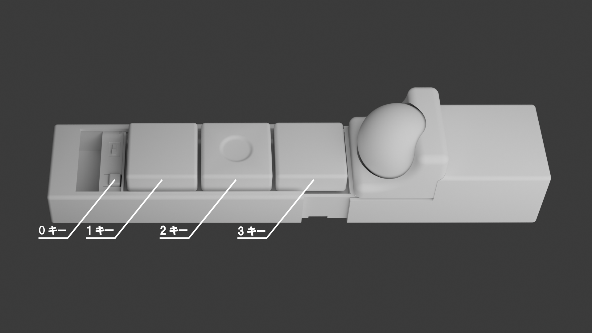
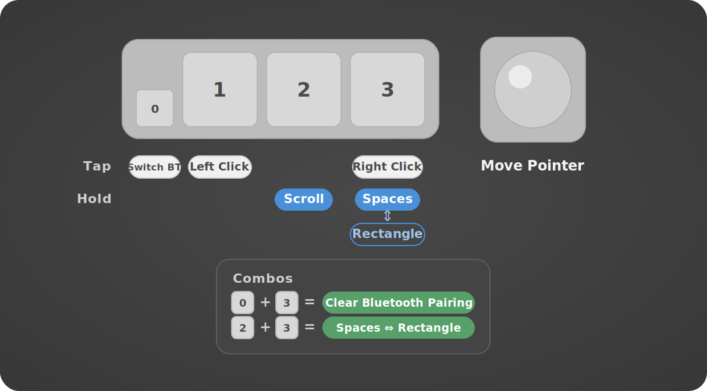
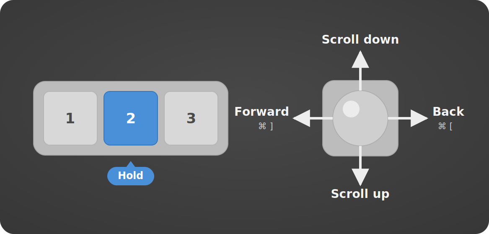
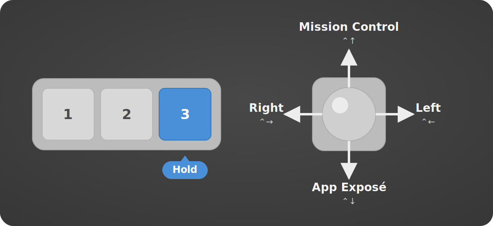
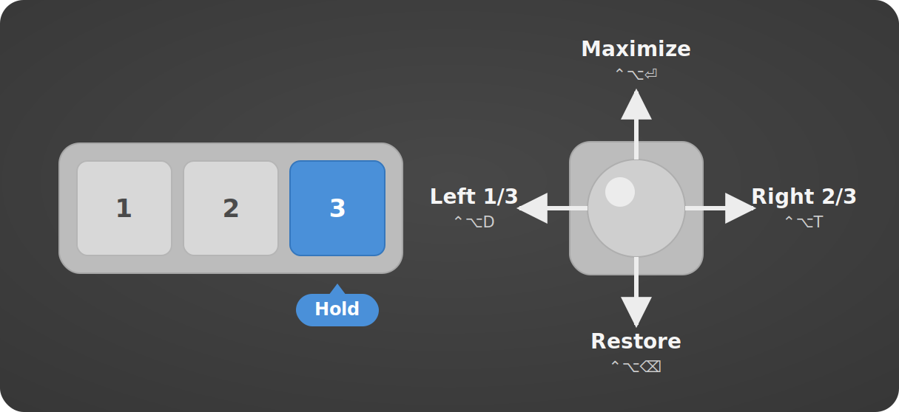

# ZMK Config for KimiBoard



This repository is a [ZMK](https://zmk.dev/) firmware configuration for sirocom's [KimiBoard](https://github.com/sirocominfo/zmk-config-KimiBoard), a 4-key Bluetooth/USB keyboard with a [PMW3610](https://www.pixart.com/products-detail/21/PMW3610DM-SUDU) trackball built on the [Seeed XIAO BLE](https://wiki.seeedstudio.com/XIAO_BLE/) (nRF52840). It supports up to 3 Bluetooth pairings, [mouse gestures](https://github.com/kot149/zmk-mouse-gesture) (scrolling, forward/back, and window management) via the trackball, and includes an [RGB LED status widget](https://github.com/caksoylar/zmk-rgbled-widget).

The KimiBoard is available for purchase at [sirocom's BOOTH shop](https://sirocom.booth.pm/items/8301933).

## Credits

This ZMK config is a fork of [sirocominfo/zmk-config-KimiBoard](https://github.com/sirocominfo/zmk-config-KimiBoard) by sirocom. Many thanks to the original author for the hardware design, base configuration, and the header photo.

## Default Keymap



Each key has a tap action, and Keys 2 and 3 are hold-taps (200 ms) that add a hold action: a quick tap sends a mouse click, while holding activates a momentary gesture layer. In the diagram above, white pills are tap actions and blue pills are hold actions. On the default layer, the trackball moves the pointer.

| Key | Tap | Hold |
|:-|:-|:-|
| 0 | Switch Bluetooth connection (cycle through BT1 → BT2 → BT3 → BT1...) | - |
| 1 | Left click | - |
| 2 | Middle click | Scroll & Navigate gesture layer |
| 3 | Right click | Spaces & Mission Control gesture layer, or Rectangle gesture layer when Rectangle override is on |

Pressing two keys together triggers a combo:

| Combo | Action |
|:-|:-|
| 0 + 3 | Clear the current Bluetooth pairing |
| 2 + 3 | Toggle Rectangle override: switches Key 3 hold between the Spaces & Mission Control and Rectangle gesture layers |

### Scroll & Navigate gestures (hold Key 2)



This layer emulates the macOS **two-finger trackpad gestures** with the trackball. Hold **Key 2** to enter the scroll layer. While held, the cursor stays still: move the trackball up or down to scroll the page, or flick left or right to navigate forward or back. The forward/back shortcuts target Chrome on macOS:

| Trackball | Action | Shortcut |
|:-|:-|:-|
| ↑ | Scroll down | - |
| ↓ | Scroll up | - |
| ← flick | Forward | ⌘] |
| → flick | Back | ⌘[ |

The up/down mapping may look reversed, but it follows **macOS-style natural scrolling**: pushing the trackball up is like swiping two fingers up on a trackpad (the page content follows your finger), so the view scrolls down.

### Spaces & Mission Control gestures (hold Key 3)



This layer emulates the macOS **three-finger trackpad gestures** with the trackball. By default, hold **Key 3** to enter it. While held, the cursor stays still: flick the trackball in any direction to trigger a macOS Spaces & Mission Control shortcut. Use the **Key 2 + Key 3** combo to switch Key 3 hold to the [Rectangle](#rectangle-window-management-gestures-hold-key-3) gestures instead.

| Trackball | Action | Shortcut |
|:-|:-|:-|
| ↑ | Mission Control | ⌃↑ |
| ↓ | App Exposé | ⌃↓ |
| ← | Move one Space right | ⌃→ |
| → | Move one Space left | ⌃← |

### Rectangle window-management gestures (hold Key 3)



With Rectangle override on (toggled by the **Key 2 + Key 3** combo), Key 3 hold enters this layer instead of Spaces & Mission Control. While held, the cursor stays still: flick the trackball in any direction to trigger a [Rectangle.app](https://rectangleapp.com/) shortcut.

| Trackball | Action | Shortcut |
|:-|:-|:-|
| ↑ | Maximize | ⌃⌥⏎ |
| ↓ | Restore | ⌃⌥⌫ |
| ← | Left 1/3 | ⌃⌥D |
| → | Right 2/3 | ⌃⌥T |

## Customization

KimiBoard's behavior is defined in the shield files under [`config/boards/shields/kimi/`](config/boards/shields/kimi). After editing any of them, rebuild and reflash the firmware (see [Building and Flashing the Firmware](#building-and-flashing-the-firmware)) for the changes to take effect.

### Trackball feel

**Pointer speed** is the trackball's CPI (counts per inch), set by the PMW3610 driver's [`res-cpi`](https://github.com/zephyrproject-rtos/zephyr/blob/main/dts/bindings/input/pixart%2Cpmw3610.yaml) property in [`kimiboard.overlay`](config/boards/shields/kimi/kimiboard.overlay):

```dts
res-cpi = <400>;
```

Raise the value for a faster pointer, lower it for finer control. Valid values range from `200` to `3200` in increments of `200` (other values are rounded down).

**Scroll speed and direction** are controlled by the SCROLL layer's [input processors](https://zmk.dev/docs/keymaps/input-processors) in [`kimiboard.keymap`](config/boards/shields/kimi/kimiboard.keymap):

```dts
input-processors = <&zip_scroll_gesture &zip_x_scaler 0 1 &zip_xy_to_scroll_mapper &zip_scroll_scaler (-1) 48>;
```

The scaler takes a **multiplier** and a **divisor**, scaling each scroll value as `value × multiplier ÷ divisor`. So `&zip_scroll_scaler (-1) 48` scales the scroll speed to `-1/48`:

- The negative sign inverts the direction to match macOS natural scrolling; use `1` instead of `-1` to reverse.
- The divisor `48` sets the speed. A larger number scrolls slower, and a smaller number scrolls faster.

Here `zip_x_scaler` and `zip_scroll_scaler` are ZMK [scaler](https://zmk.dev/docs/keymaps/input-processors/scaler) processors and `zip_xy_to_scroll_mapper` is a [code mapper](https://zmk.dev/docs/keymaps/input-processors/code-mapper), while `zip_scroll_gesture` comes from the [`zmk-mouse-gesture`](https://github.com/kot149/zmk-mouse-gesture) module.

**Gesture sensitivity** is the [`stroke-size`](https://github.com/kot149/zmk-mouse-gesture#options) property on each gesture node (`zip_scroll_gesture`, `zip_desktop_gesture`, and `zip_rectangle_gesture`) in [`kimiboard.keymap`](config/boards/shields/kimi/kimiboard.keymap):

```dts
stroke-size = <100>;  // default: 200
```

It sets how far the trackball must travel (in raw counts) to register one directional stroke of a gesture. Lower it so flicks trigger with a shorter, lighter movement; raise it to require a longer, more deliberate flick and avoid accidental gestures. Note `stroke-size` is measured in raw counts, not physical distance, so changing `res-cpi` also changes how far you physically move for a given `stroke-size`.

**Gesture cooldown** is the [`gesture-cooldown-ms`](https://github.com/kot149/zmk-mouse-gesture#options) property on the same gesture nodes in [`kimiboard.keymap`](config/boards/shields/kimi/kimiboard.keymap):

```dts
gesture-cooldown-ms = <200>;  // default: 500
```

After a gesture fires, processing pauses for this many milliseconds before the next gesture can be recognized, which prevents an accidental double trigger from one continuous flick. Lower it to fire repeated gestures (such as moving across several Spaces) more quickly; raise it if a single flick sometimes registers twice.

### Keys and layers

**Tap actions** are the `default_layer` bindings in [`kimiboard.keymap`](config/boards/shields/kimi/kimiboard.keymap), listed left to right as Keys 0 to 3:

```dts
&bt BT_NXT  &mkp LCLK  &mo_mkp SCROLL MCLK  &mo_mkp DESKTOP RCLK
```

Keys 0 and 1 are plain taps: Key 0 cycles the [Bluetooth](https://zmk.dev/docs/keymaps/behaviors/bluetooth) connection (`&bt`) and Key 1 sends a [mouse click](https://zmk.dev/docs/keymaps/behaviors/mouse-emulation) (`&mkp`). Keys 2 and 3 use the `mo_mkp` [hold-tap](https://zmk.dev/docs/keymaps/behaviors/hold-tap), where the first parameter is the [**hold** layer](https://zmk.dev/docs/keymaps/behaviors/layers) and the second is the **tap** mouse click. For example, swap `LCLK` for `RCLK` to make Key 1 a right click, or change `DESKTOP` to set which layer Key 3 holds into.

**Hold vs. tap timing** is set by the `mo_mkp` [hold-tap](https://zmk.dev/docs/keymaps/behaviors/hold-tap) behavior in the same file:

```dts
flavor = "tap-preferred";
tapping-term-ms = <200>;
```

Lower `tapping-term-ms` to trigger the gesture layer (hold) sooner; raise it to leave more time for a clean click (tap).

**Combo timing** is the `timeout-ms` of each [combo](https://zmk.dev/docs/keymaps/combos) in [`kimiboard.keymap`](config/boards/shields/kimi/kimiboard.keymap):

```dts
timeout-ms = <50>;  // default: 50
```

Both keys of a combo must be pressed within this many milliseconds to register together. Lower it to make accidental combos less likely (the two keys must be hit closer to simultaneously); raise it if a combo is hard to trigger reliably.

Key 3's hold layer defaults to Spaces & Mission Control. The Key 2 + Key 3 combo toggles it to Rectangle. See [Default Keymap](#default-keymap) for details.

## Building and Flashing the Firmware

For reproducible builds, this config pins its upstream dependencies ([`zmk`](https://github.com/zmkfirmware/zmk), [`zmk-rgbled-widget`](https://github.com/caksoylar/zmk-rgbled-widget), and [`zmk-mouse-gesture`](https://github.com/kot149/zmk-mouse-gesture)) to fixed commit SHAs in [`config/west.yml`](config/west.yml). See [Updating Pinned Versions](#updating-pinned-versions) to bump them.

### GitHub Actions (CI)

GitHub Actions builds the firmware automatically on every push and pull request, producing two `.uf2` images you can download from the Actions run page. See the [ZMK user setup guide](https://zmk.dev/docs/user-setup#install-the-firmware) for the standard GitHub Actions download flow:
- **kimiboard**: main firmware with ZMK Studio support
- **settings_reset**: utility firmware to reset stored settings

### Local Build (macOS + colima + Dev Container)

Based on the ZMK [Container Setup](https://zmk.dev/docs/development/local-toolchain/setup/container) and [Build & Flash](https://zmk.dev/docs/development/build-flash) documentation.

#### Prerequisites

```bash
brew install colima docker devcontainer
```

#### Setup

First create a workspace directory and `cd` into it. **All commands in the Setup, Build, and Flash sections are run from this directory**, which holds `zmk-config-KimiBoard`, `zmk`, and `zmk-modules` as siblings.

```bash
mkdir -p kimiboard-workspace
cd kimiboard-workspace
```

Then clone this repository and read its pinned SHAs into shell variables. These SHAs are the single source of truth: they live as the `revision` values of the `zmk`, `zmk-rgbled-widget`, and `zmk-mouse-gesture` projects in [`config/west.yml`](config/west.yml).

```bash
git clone https://github.com/susumuota/zmk-config-KimiBoard.git

ZMK_REV=$(awk '/name: zmk$/{f=1} f&&/revision:/{print $2; exit}' zmk-config-KimiBoard/config/west.yml)
RGBLED_REV=$(awk '/name: zmk-rgbled-widget/{f=1} f&&/revision:/{print $2; exit}' zmk-config-KimiBoard/config/west.yml)
MOUSEGESTURE_REV=$(awk '/name: zmk-mouse-gesture/{f=1} f&&/revision:/{print $2; exit}' zmk-config-KimiBoard/config/west.yml)

echo "ZMK_REV: $ZMK_REV"
echo "RGBLED_REV: $RGBLED_REV"
echo "MOUSEGESTURE_REV: $MOUSEGESTURE_REV"
```

Then clone the ZMK firmware source and extra modules, checking out the same pinned commits so local builds match CI:

```bash
git clone https://github.com/zmkfirmware/zmk.git
(cd zmk && git checkout "$ZMK_REV")

git clone https://github.com/caksoylar/zmk-rgbled-widget.git zmk-modules/zmk-rgbled-widget
(cd zmk-modules/zmk-rgbled-widget && git checkout "$RGBLED_REV")

git clone https://github.com/kot149/zmk-mouse-gesture.git zmk-modules/zmk-mouse-gesture
(cd zmk-modules/zmk-mouse-gesture && git checkout "$MOUSEGESTURE_REV")
```

Start colima and create Docker volumes to mount the config and modules into the container. The `colima start` flags allocate 2 CPUs (`-c 2`), 4 GB RAM (`-m 4`), and a 100 GB disk (`-d 100`), and use the macOS `vz` virtualization backend (`-t vz`).

```bash
colima start -c 2 -m 4 -d 100 -t vz

docker volume create --driver local -o o=bind -o type=none \
  -o device="$(pwd)/zmk-config-KimiBoard" zmk-config

docker volume create --driver local -o o=bind -o type=none \
  -o device="$(pwd)/zmk-modules" zmk-modules

docker volume ls
```

Start the Dev Container:

```bash
devcontainer up --workspace-folder "$(pwd)/zmk"
docker ps -a
```

Initialize the Zephyr workspace from the host. You only need to do this once, after creating the container workspace:

```bash
devcontainer exec --workspace-folder "$(pwd)/zmk" bash -lc 'west init -l app/'
```

```bash
devcontainer exec --workspace-folder "$(pwd)/zmk" bash -lc 'west update'
```

`west update` clones the Zephyr tree and all module dependencies, so it can take several minutes (sometimes longer on a slow connection). This is expected — let it run to completion.

If `west init` reports that the workspace is already initialized and you intentionally want to reinitialize it, run this first. It removes only the `.west` metadata; it does not delete the checked-out source trees. Then run the `west init` and `west update` commands above again:

```bash
devcontainer exec --workspace-folder "$(pwd)/zmk" bash -lc 'rm -rf .west'
```

#### Build

Run the local build script from the host with `devcontainer exec`. [`scripts/build-local.py`](scripts/build-local.py) locally emulates ZMK's [reusable user config build workflow](https://github.com/zmkfirmware/zmk/blob/main/.github/workflows/build-user-config.yml). It reads [`build.yaml`](build.yaml), runs each build inside the container, and writes the resulting `.uf2` files to `firmware/` using the same artifact names as GitHub Actions. For fallback artifact names, spaces are replaced with underscores.

```bash
devcontainer exec --workspace-folder "$(pwd)/zmk" bash -lc \
  'cd /workspaces/zmk-config && python3 scripts/build-local.py'
```

To inspect the generated `west build` commands without building, add `--dry-run`.

Each target builds incrementally in its own directory under `/tmp/zmk-build/` inside the container, so rebuilding after a keymap or config edit only recompiles what changed. This build directory lives on the container's filesystem rather than the virtiofs-mounted source tree, which keeps the build from being bottlenecked by host I/O. To put the build elsewhere, pass `--build-root <path>`.

Because builds are incremental, a few changes need a clean (pristine) rebuild to be picked up reliably: switching board or shield, bumping the pinned dependencies (`west update`), adding or removing source/overlay files, or recovering from an interrupted build. Editing the contents of `.keymap`, `.conf`, or `.overlay` files does **not** require this. To force a clean build, delete the build directory first:

```bash
devcontainer exec --workspace-folder "$(pwd)/zmk" bash -lc 'rm -rf /tmp/zmk-build'
```

#### Flash

Put the board into bootloader mode (double-tap reset), then copy the firmware to the board. The `-X` flag is macOS only and prevents extended attribute errors with UF2 mass storage.

Flash the settings reset firmware first:

```bash
cp -X zmk-config-KimiBoard/firmware/settings_reset-xiao_ble__zmk-zmk.uf2 /Volumes/XIAO-SENSE/
```

Put the board into bootloader mode again, then flash the main firmware:

```bash
cp -X zmk-config-KimiBoard/firmware/kimiboard_rgbled_adapter-xiao_ble__zmk-zmk.uf2 /Volumes/XIAO-SENSE/
```

#### Cleanup

Stop and remove the Dev Container:

```bash
docker ps -a
docker stop <container_id>
docker rm <container_id>
docker ps -a
```

Remove Docker volumes created by the setup and the Dev Container:

```bash
docker volume ls
docker volume rm zmk-config zmk-modules \
  zmk-root-user zmk-zephyr zmk-zephyr-modules zmk-zephyr-tools
docker volume ls
```

Stop colima:

```bash
colima status
colima stop
colima status
```

To also delete the colima VM:

```bash
colima list
colima delete
colima list
```

### Updating Pinned Versions

To move the pinned dependencies to newer upstream commits:

1. Find the SHAs you want. For the latest commit on each project's tracked branch (`main` for `zmk` and `zmk-rgbled-widget`, `v1` for `zmk-mouse-gesture`):

```bash
git ls-remote https://github.com/zmkfirmware/zmk.git refs/heads/main
git ls-remote https://github.com/caksoylar/zmk-rgbled-widget.git refs/heads/main
git ls-remote https://github.com/kot149/zmk-mouse-gesture.git refs/heads/v1
```

2. Update the three `revision` values in [`config/west.yml`](config/west.yml).
3. Update the workflow ref in [`.github/workflows/build.yml`](.github/workflows/build.yml) to the same SHA as the `zmk` revision (these must stay in sync).
4. Commit the changes.
